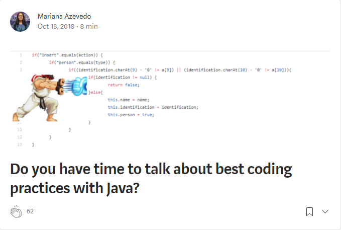

# artigo-boas-praticas-medium 

Implementações dos exemplos demonstrados no artigo publicado na minha página no Medium, pelo EqualsLab. Link abaixo:

[Tem um tempinho para conversarmos sobre boas práticas de programação com Java?](https://bit.ly/2Cs4PxN)

## Outros artigos relacionados com o tema Qualidade Interna de Software

* [Princípios S.O.L.I.D: o que são e porque projetos devem utilizá-los](https://bit.ly/2o97vY1)
* [Existe avaliação e garantia de qualidade no seu código durante o desenvolvimento e depois do deploy?](https://bit.ly/2BLwPgi)
* [Qualidade e JUnit: introduzindo automatização de testes unitários do seu software Java no dia-a-dia](https://bit.ly/2Oosil4)
* [Utilizando Travis CI como servidor de integração contínua em projetos open-source: um exemplo com a linguagem Java](https://bit.ly/2QVowWw)
